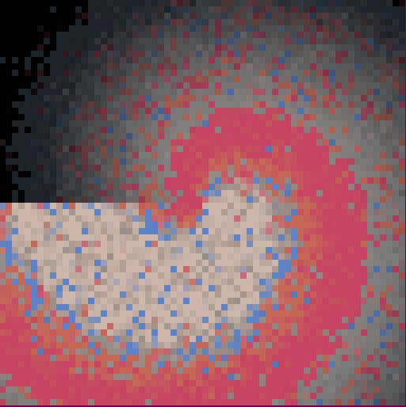

# Bruitage avec recuit simulé

## Kessecé ?

On part d'une image complètement bruitée (ou image quelconque), et on utilise la méthode de [recuit simulé](https://fr.wikipedia.org/wiki/Recuit_simul%C3%A9) pour la transformer

## Exemples

### Avec bruit de couleur, mode "distance euclidienne"

<video src="assets/bruitage_euclidien-2023-06-08_08.46.38.mp4" controls title="exemple_couleur"/>

### Transformation d'image

Etant donné une image :

#### En spirale

## TODO

- [ ] : Faire énergie "masque"
- [ ] : Faire générateur de masque
    - [ ] : Générer masque à partir d'une image  